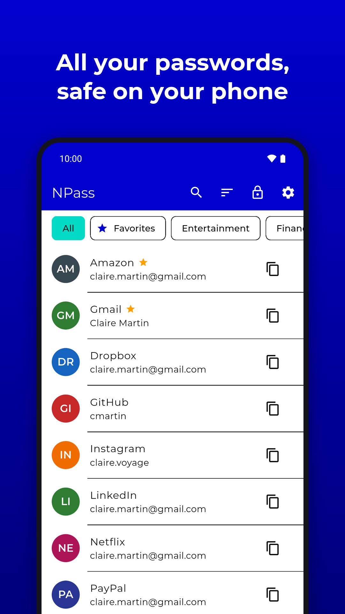
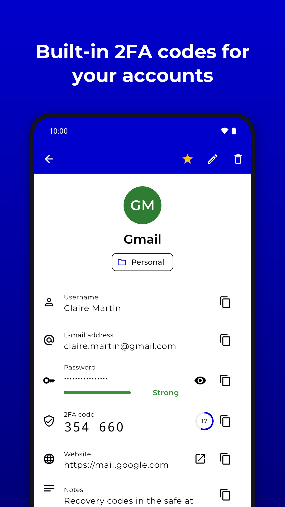
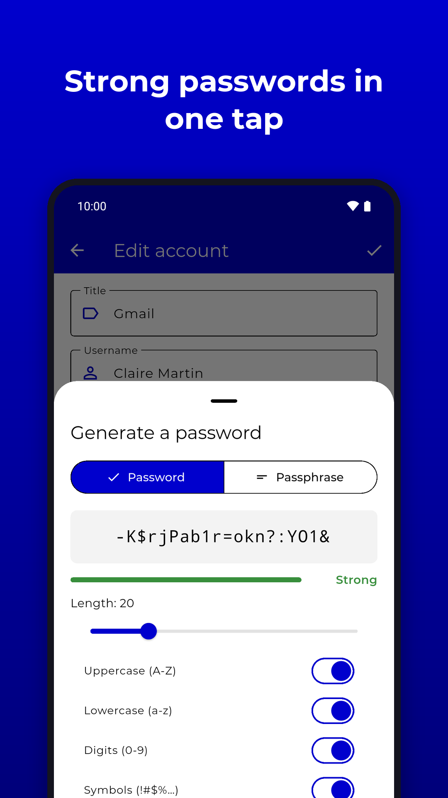
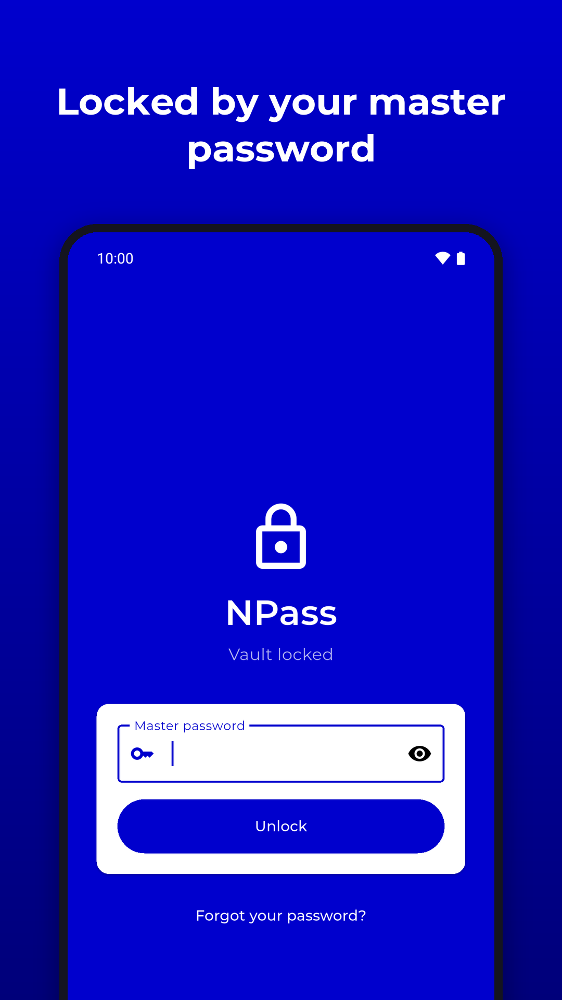
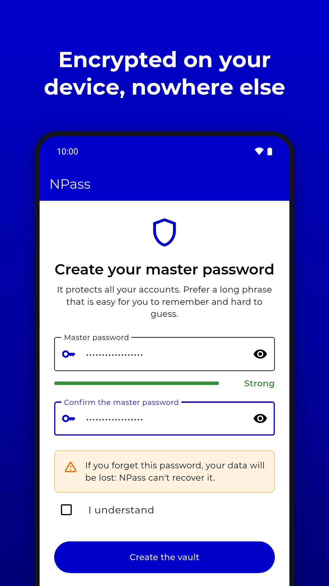
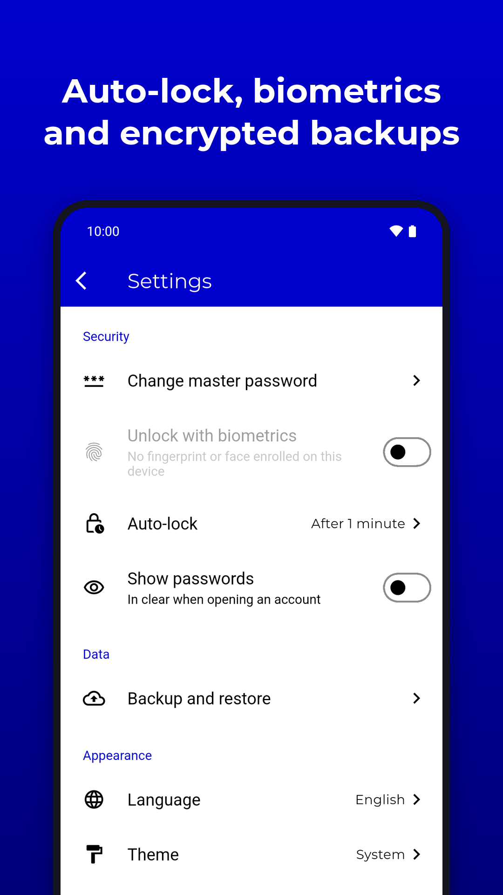

# NPass

[](https://github.com/netersoft/n-pass/actions/workflows/flutter.yml)

## Description

NPass is an offline password manager for Android and iOS. Accounts are encrypted on the device with a key derived from a master password, and never leave it except through an encrypted backup file the user exports.

This is a full rewrite in Flutter of the original native Android app (`com.neteru.n_pass`, Java, 2018–2020). The old project is archived at [netersoft/n-pass-legacy](https://github.com/netersoft/n-pass-legacy); no data is migrated from it.

The app is fully offline: no backend, no analytics, no crash reporting, no Firebase.

## Screenshots

<table>
  <tr>
    <td></td>
    <td></td>
    <td></td>
  </tr>
  <tr>
    <td></td>
    <td></td>
    <td></td>
  </tr>
</table>

The Play Store images, in English; other languages are in `store/screenshots/<lang>/`.

## Tech stack

- Mobile: Flutter, Dart SDK `>=3.8.0 <4.0.0`
- State management: Riverpod (`riverpod_generator`, code-gen)
- Routing: go_router (`go_router_builder`)
- Local storage: Hive CE (encrypted boxes) + `flutter_secure_storage` + SharedPreferences
- i18n: [Slang](https://pub.dev/packages/slang) (French and English, English base locale)

## Prerequisites

- Flutter SDK matching `>=3.8.0 <4.0.0` (CI runs on the `stable` channel)
- Android: the Gradle/AGP/Kotlin versions of the installed Flutter SDK's templates (currently Gradle 9.3.1, AGP 9.1.0, Kotlin 2.4.0)

## Installation

```bash
flutter pub get
dart run slang
dart run build_runner build --delete-conflicting-outputs
flutter run --flavor dev   # Android
flutter run                # iOS
```

## Environment variables

None. The app has no remote configuration; theme colors live in `lib/view/themes/app_theme.dart`.

## Running tests

```bash
flutter test
# with coverage, as run in CI:
flutter test --coverage
```

## Environments

| Env        | Store listing | Deployment |
|------------|---------------|------------|
| Production | Google Play (`com.neteru.n_pass`), App Store (`com.neteru.npass`) | Manual upload |

The iOS bundle identifier differs because iOS does not allow `_` in bundle identifiers.

## Contacts

- Tech lead: @noeGnh

## Architecture

- `lib/main.dart`: entry point.
- `lib/core/bootstrap/app_bootstrap.dart`: Flutter binding, Hive, DI and locale bootstrap.
- `lib/app.dart`: root widget, theme and router view.
- `lib/core/`: providers, services, routes, helpers, extensions and tools.
- `lib/view/`: screens, reusable components and themes.

All providers use `@riverpod` code generation. `GetIt` (with `injectable`) holds infrastructure singletons: shared preferences, Hive and navigation.

Routes are declared in `lib/core/routes/app_route.dart` (type-safe `go_router_builder` definitions) and wired in `lib/core/routes/router.dart`.

Translations live in `assets/i18n/*.i18n.json` and are used through `context.t` / `t`.

Generated files (`*.g.dart`, `*.config.dart`) are git-ignored and must not be edited by hand.

## Security model

Implemented in `lib/core/services/vault/` with [`cryptography`](https://pub.dev/packages/cryptography) (pure Dart, no native code):

- A random 256-bit **vault key** encrypts every entry with AES-256-GCM. Each entry is serialized to JSON and encrypted as a whole, with its id bound as associated data, so a ciphertext can't be moved to another entry.
- The vault key is stored encrypted with a **key derived from the master password** with Argon2id (64 MiB, 2 passes, 1 lane, random 16-byte salt). The derivation runs in a background isolate and takes about 0.5 s on the Android emulator. The parameters are stored next to the wrapped key, so they can be raised later.
- Changing the master password only re-encrypts the vault key.
- The header also holds a check value encrypted with the vault key. It validates a key obtained without the password (e.g. released by biometrics).
- The master password is never stored, and a forgotten master password can't be recovered.
- Entries live in the Hive box `vault_entries` as opaque blobs. The header lives in `vault_meta`.

Around the vault:

- **Biometric unlock** (optional, `lib/core/services/biometrics/`): a copy of the vault key is stored with `flutter_secure_storage` behind strong biometrics. On Android it sits in a Keystore key that requires user authentication for each read. On iOS it is a Keychain item bound to the currently enrolled biometric set. If enrolled biometrics change, the key is invalidated: the app falls back to the master password and turns biometrics off; turning them back on in the settings stores the key again under a fresh Keystore key.
- **Workaround for flutter_secure_storage 11.2.0:** the first write to a new biometric store caches the unlocked cipher (`FlutterSecureStorage.java:659`). Until the app restarts, later reads skip the prompt despite `requireBiometricsPerOperation`. In that session, an explicit `local_auth` prompt guards the read. The plugin also reports an invalidated Keystore key only inside a generic error, and can't delete it unless `resetOnError` is on: reads keep it off (a cancelled prompt must not wipe the key), writes and deletes turn it on.
- **Auto-lock** (`lib/core/services/auto_lock/`): the vault locks when the app comes back after a configurable delay in the background (default 1 minute; 0 locks as soon as the app leaves the foreground). While a system screen opened by the app is in front (file picker, share sheet), the delay is at least 5 minutes, so exporting a backup doesn't lock the vault. The lock button in the app bar locks it immediately. Once locked, the router keeps every screen except intro, create and unlock out of reach.
- **Clipboard:** passwords and notes are copied through a native channel (`npass/clipboard`). On Android the clip is flagged sensitive, which hides it from the Android 13+ clipboard preview and keyboard suggestions, and it is cleared after 30 s unless something else was copied meanwhile. The check only reads the clip description, so it doesn't trigger the "pasted from your clipboard" toast. On iOS the item is local-only (no Universal Clipboard) and expires after 30 s.
- **Encrypted backups** (`lib/core/services/backup/`): an export is a JSON file (`.npass`) holding Argon2id parameters with a fresh salt and the entries encrypted with AES-256-GCM, under a key derived from a backup password chosen at export time (independent from the vault key, so a backup survives a new vault). Files leave and enter the app through the system document picker (Storage Access Framework on Android, through the `npass/files` channel) or the share sheet: no storage permission. Import either merges (matching entries by id, keeping the most recently updated copy) or replaces the vault content.
- **Two-factor codes** (`lib/core/tools/functions/totp.dart`): an entry can hold a TOTP secret (RFC 6238; SHA-1/256/512, 6 to 8 digits), typed or pasted as a base32 key or an `otpauth://` link. It is encrypted with the rest of the entry and included in backups. Secrets shorter than 80 bits are refused. The 2FA QR code can be scanned with the camera (`qr_code_scanner_plus`: ZXing on Android, AVFoundation on iOS; no ML Kit, which would add the Internet permission) or read from an imported screenshot (decoded by the engine, QR search with `zxing2` in an isolate). The camera permission is requested by the app itself (`npass/camera` channel on Android), because the plugin asks again on every resume while it is denied.
- **Screen protection:** release builds set `FLAG_SECURE` on Android, which blocks screenshots, screen recording and the recent-apps thumbnail. Debug builds leave it off so the UI can be checked with screenshots. On both platforms, a cover hides the unlocked vault while the app is inactive or in the background.

## Branding

The launcher icon, splash logo and About logo are generated by `tool/generate_icons.py` from one vector padlock, redrawn after the legacy app icon (`assets/images/launcher/icon.svg` is the full icon). After changing it, run `dart run icons_launcher:create` and `dart run flutter_native_splash:create`.

The privacy policy ships in the app (`assets/docs/<locale>/privacy_policy.html`). The store listings link to the public copy at https://netersoft.github.io/n-pass/privacy/ (English: `/en/`), served by GitHub Pages from the public `netersoft/netersoft.github.io` repository. After editing the policy, regenerate the pages and push that repository:

```bash
python3 tool/build_privacy_pages.py ~/Dev/Projects/Web/netersoft.github.io
```

## Third-party content

- `assets/wordlists/eff_large_wordlist.txt`: the [EFF large wordlist](https://www.eff.org/dice) for passphrases (dice numbers removed), by the Electronic Frontier Foundation, licensed under [CC BY 3.0 US](https://creativecommons.org/licenses/by/3.0/us/).

## Quality

```bash
dart format .
flutter analyze
flutter test
```

## Build flavors (Android)

`dev`, `staging` and `prod` flavors only change the app identity (`applicationId` suffix and app name), so they can be installed side by side:

```bash
flutter run --flavor dev
flutter build appbundle --flavor prod --release
```

iOS has no flavors; `flutter run` / `flutter build ios` work without `--flavor`.

## Release builds

### Android signing

The Play Store listing is signed with the Neteru upload key (`neteru-key`), the same one used by the other Neteru apps. Copy `android/key.properties` and the keystore it points to from an existing Neteru project (e.g. `statistique-descriptive`), with `storeFile` relative to `android/app/`. Both files are git-ignored. Without `key.properties`, release builds fall back to the debug key.

The new app must keep `versionCode` above the last legacy release (5).

### CI

Pushing a `v*` tag (or running the workflow manually) builds a release APK (`prod` flavor, debug-signed in CI) and an unsigned iOS build, after the quality job passes.

## License

NPass is free software by Netersoft.

- **Code**: the source code (`lib/`, `test/`, `tool/` and the platform folders) is licensed under the [GNU General Public License v3.0](LICENSE).
- **Content**: the texts, translations and pictures made by Netersoft for the app are licensed under [Creative Commons Attribution-ShareAlike 4.0](https://creativecommons.org/licenses/by-sa/4.0/).
- **Third-party files** keep their own licenses: the Montserrat and Open Sans fonts (SIL Open Font License 1.1, `assets/fonts/*/OFL.txt`) and the EFF wordlist (see [Third-party content](#third-party-content)).
- **Names and icons**: the Netersoft name, the NPass name, and the app icons and logos (`assets/images/launcher/`) are not covered by these licenses. A modified version must use another name and icon.

Copyright © 2018-2026 Netersoft.
